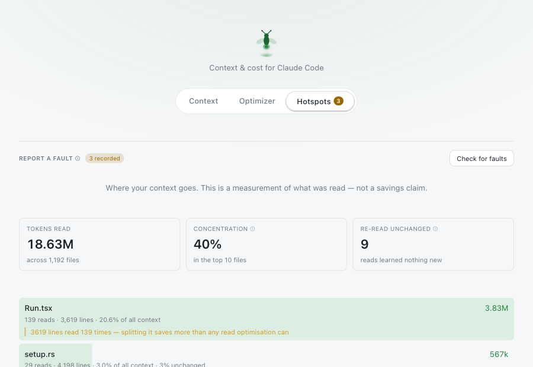
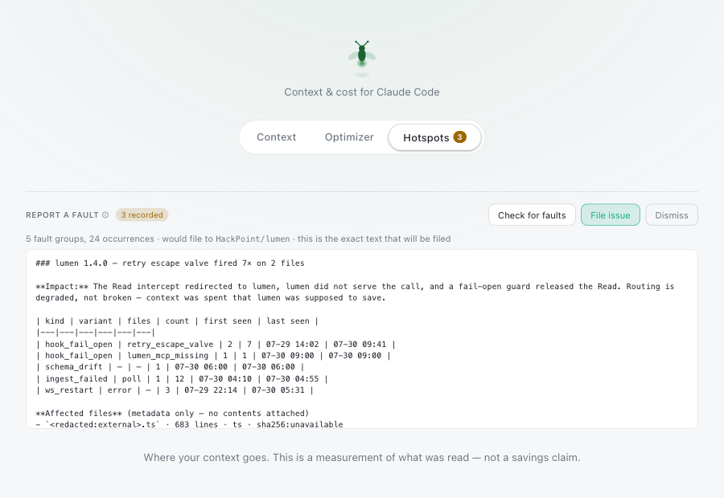
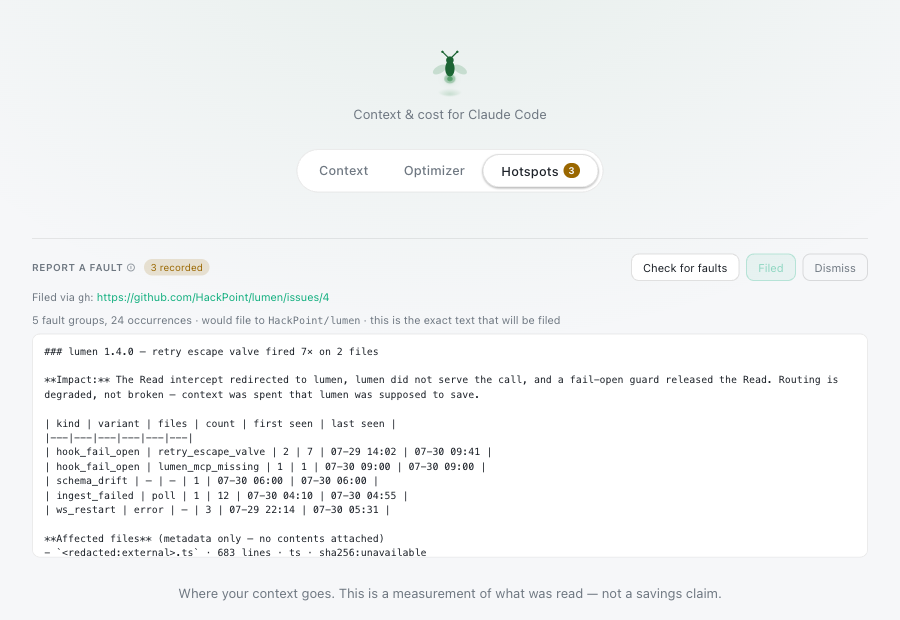
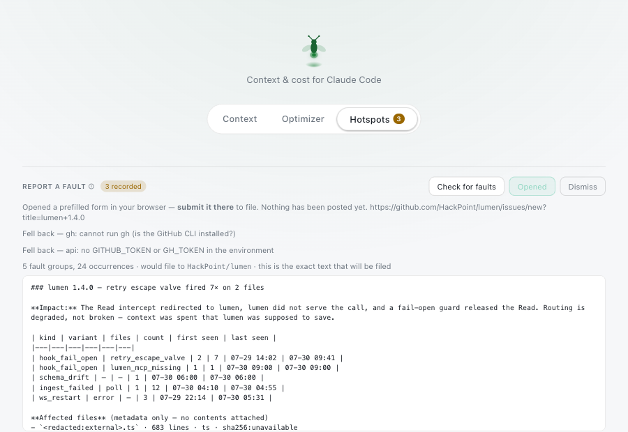

# Filing a fault report

Lumen records its own faults — routing that degraded, transcripts it failed to ingest,
a database whose schema drifted — and can turn them into a GitHub issue.

Two rules hold throughout:

- **Nothing is sent until you ask.** Recording is local. Filing is a separate, explicit
  action.
- **You see the exact text first, and that text is what gets sent.** The body is never
  re-generated at send time, so what you approved is what is published.

---

## From the app

### 1. Find it

The **Hotspots** tab carries a badge with the number of faults waiting. The
**Report a fault** row sits directly under the navigation.



If the badge is absent, nothing has been recorded and there is nothing to report. The
row is still there, and **Check for faults** still works.

> The tray popover is a different window with no navigation of its own. When faults
> exist it shows a row you can click, which reveals the main window — the popover
> deliberately cannot file anything, because it is too small to show you the body first.

### 2. Check, and read what it would send

**Check for faults** renders the report locally. No network call happens at this step.



The summary line says how many fault groups and occurrences there are, and which
repository it would file to. Below it is the body, scrollable — read it. This is
literally the text that will be published.

What it contains, and deliberately does not:

| included | excluded |
| --- | --- |
| Fault kind, which guard or route fired, counts, first and last seen | File contents — never, on any path |
| Repo-relative paths, line counts, a SHA-256 of the content | Paths outside the Lumen workspace — reduced to the extension, because a name like `acme_client_billing.ts` identifies a client on its own |
| Version, OS, architecture, channel, MCP scope, column counts | Values of path-valued `LUMEN_*` variables — shown as `<path>` |

### 3. File it

**File issue** publishes. On success the row names the route that worked and links the
issue.



Filing the same fault twice does not open a duplicate — see
[Deduplication](#deduplication) below. **Dismiss** discards the report without sending
anything.

---

## From the terminal

```bash
lumen report --dry-run      # render and print it; sends nothing
lumen report                # print it, then refuse to file — a deliberate stop
lumen report --yes          # file it
```

`--yes` is required. Without it, `lumen report` prints the body and exits `2` with a
notice, so filing is never something that happens because a flag was forgotten.

### If `lumen` is not a command

The `lumen` command comes from the **`lumen-cli` formula**, not from the app. A cask-only
install (`brew install --cask lumen-app`) puts nothing on your `PATH` — the CLI is inside
the bundle, where you can still call it directly:

```bash
/Applications/Lumen.app/Contents/MacOS/lumen-cli report --dry-run
```

That path matters in exactly the case this page exists for. If the app itself will not
start — no menu-bar icon, no window — the UI route is unavailable, and the terminal route
is the only one left. It reads the same database and files the same report.

For a `lumen` on your `PATH`, install the formula alongside the cask:

```bash
brew install hackpoint/tap/lumen-cli
```

The cask does not link the bundled binary itself: doing so would have to declare a conflict
with the formula, and then the two could not be installed together.

Useful flags:

| flag | effect |
| --- | --- |
| `--repo owner/name` | file somewhere else — a fork, or a scratch repo to rehearse against |
| `--faults <file>` | render a JSON fixture instead of the database |
| `--include-source` | embed in-workspace file bodies; prints a manifest of exactly what it will send, first |

`--include-source` is the one flag that changes what leaves the machine. It only ever
reaches files inside the Lumen workspace, and it prints every file and byte count to
stderr before the body goes anywhere.

---

## How it decides to send

Three routes, tried in order. The first that works wins.

| order | route | needs | can comment on an existing issue |
| --- | --- | --- | --- |
| 1 | `gh issue create` / `gh issue comment` | GitHub CLI, authenticated | yes |
| 2 | `POST /repos/{repo}/issues` | `GITHUB_TOKEN` or `GH_TOKEN` | yes |
| 3 | Prefilled browser form | a browser | no — opens the existing issue instead |

**The browser route is a handoff, not a filing.** It opens GitHub's new-issue form with
the body already filled in. Nothing exists on the tracker until you press Submit there,
and Lumen says exactly that rather than reporting it as filed:



Notice the button says **Opened**, not *Filed*, and both skipped routes are listed with
their reasons. A fallback that happened silently would hide that your preferred route is
broken — if you expected `gh` to be used and it was not, the reason is on screen.

Why a chain at all: `gh` is the only route that can post a follow-up comment without a
human, but most people running the app do not have it installed. The browser route needs
nothing, so there is always a way to report a fault.

### Setting up route 2

If you would rather not install the GitHub CLI, export a token with permission to open
issues:

```bash
export GITHUB_TOKEN=ghp_your_token_here
```

Lumen reads it only from the environment — never from a file, a keychain, or a prompt.
When it makes the request the token is passed in a `curl --config` file created with
`0600` permissions, never on the command line, because arguments are readable by any
other process on the machine.

---

## Deduplication

Every report carries a fingerprint of `(kind, variant, version)` as an HTML comment at
the end of the body:

```html
<!-- lumen-fault: ffd15312 -->
```

Before filing, Lumen scans open issues for that marker. If it finds one, it comments on
that issue instead of opening a duplicate — so re-running a report is safe.

Two details worth knowing:

- The scan reads issue bodies and matches locally rather than using GitHub's search,
  which does not reliably index text inside HTML comments. A dedupe that silently missed
  would open a duplicate on every single run.
- The scan works **without any credentials** on a public repository. A token is only ever
  needed to *write*. If the scan fails entirely, Lumen files anyway rather than losing
  the report, and tells you it might have duplicated.

Because the version is part of the fingerprint, a fault that reappears in a new release
files as a new issue rather than reviving the old one.

---

## Turning it off

| variable | effect |
| --- | --- |
| `LUMEN_CAPTURE=0` | keep the fail-open guards, record no faults at all |
| `LUMEN_FAULT_SPOOL=<path>` | write the spool somewhere else |
| `LUMEN_HOOK_ENABLED=0` | disable Read interception entirely, so its guards never fire |

Recording is local either way. See [Security & privacy](../README.md#security--privacy)
in the README for exactly what the hooks read and write.
